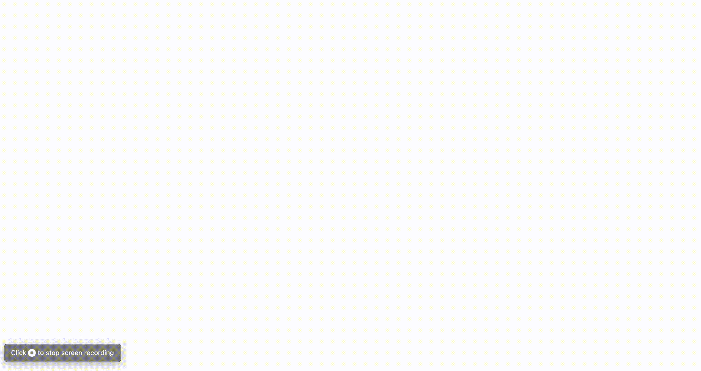

# material-timeline component
A React Timeline component using Material-UI



## Example on GIF
To find out how to make the components look exactly like they look in the GIF above
go to the project's repository and clone it.
You can run `npm install` and then `npm start` to see the component in action.
You will find the implementation of this demo at __src/index.js__

## Installation

Run `npm install material-timeline`

## Dependencies

This package uses components created from __material-ui__ so it will automatically install
`@material-ui/core`
and `@material-ui/icons` in order for the Timeline components to work properly

## Usage

### Timeline

To create a Timeline component you can follow this example

```html
    <Timeline
            isLeft={isLeft}
            isOneWay={!isDesktop}
            wrapItem={wrapItem}>
            {timelineItems.length > 0 ? timelineItems : (<CircularProgress style={
              {
                alignSelf: 'center',
                background: this.props.theme.palette.background.default
              }
            } />)}
          </Timeline>
```

__Props:__
- __isLeft:__ __function(item, index), returns Boolean__.
> It should return if each element should be on the left side or not. __NOTE__ it is 
ignored if the Timeline is one way 
- __isOneWay: Boolean__
>  Specifies if the Timeline is one way only, you can use it for example if the screen changes
to mobile size

- __side:__ `'left'` or `'right''`
> If the element isOneWay then you can specify the side of the timeline. There is a `directions`
enum that you can import and use

- __wrapItem: function(item, index), returns newly created node__
> After passing the TimelineItems as children to the Timeline, you may
want to wrap each Item with other components e.g. for animating them.
You can do that by implementing a function to pass as a parameter to wrap item.
__NOTE__ the `item` argument is a reactElement, not just data.

- __stackedImages: Boolean__
> Specifies if the TimelineItems should have their image at the Left or at the Top.

In order to avoid bad usage, possible styles that can break the Timeline's functionality, are removed from
the `styles` property. 
These are currently `listStyleType, listStylePosition` 


### TimelineItem

To create a TimelineItem component you can follow the example below

```html
<TimelineItem
            titleChildren={(<Typography gutterBottom variant={isDesktop ? 'h6' : 'body2'}>{item.title}</Typography>)}
            yearBackgroundColor='#00acc1'
            yearColor='white'
            cardContentChildren={timelineItemContent}
            cardHeaderChildren={timelineItemHeader}
            iconContent={timelineItemIcon}
            cardMediaProps={cardMediaProps}
            key={key}
            expandableCardContent
            padTop
            hasDivider />
```

__Props__

- __titleChildren: node__
> Accepts all the components that should be placed in the item's Title section

- __yearBackgroundColor: string__
> Specifies the background color of the Middle Item as well as the Vertical Line in the timeline

- __yearColor: string__
> Specifies the text color in the Middle Item

- __cardContentChildren: node__
> Accepts all the components that should be placed in the item's Content section

- __cardHeaderChildren: node__
> Accepts all the components that should be placed in the item's Header section (Below
the Title)

- __iconContent: node__
> Accepts all the components that should be placed in the item's Middle Item section

- __cardMediaProps: object {imgUrl: string, height: string}__
> Accepts an object containing the imageUrl of the image as well as the height of the image.
__NOTE__ if the height is not set then the image won't be visible

- __expandableCardContent: boolean__
> Specifies if the card content is initially hidden and can be expanded

- __padTop: boolean__
> Adds top padding of 4px in the card

- __hasDivider: boolean__
> If true, adds a divider between the cardHeader and the cardContent

- __customLine: String__
> This is a css property to set the line's styling (background css property).
E.g. value `linear-gradient('#fafafa, #fafafa ) no-repeat center/4px 100%`
